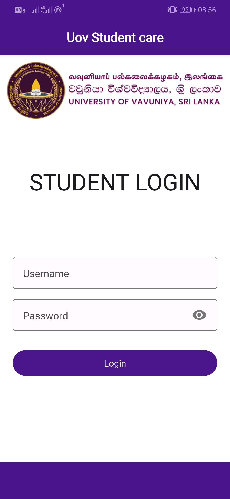
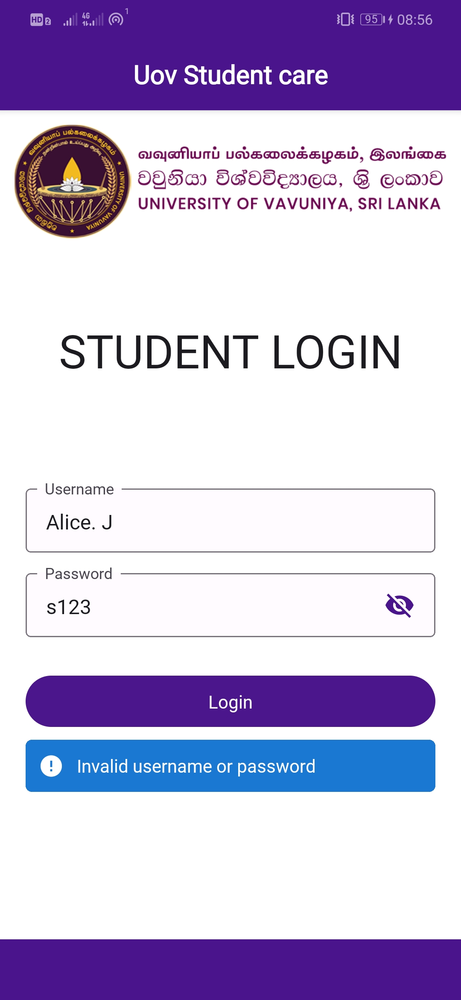
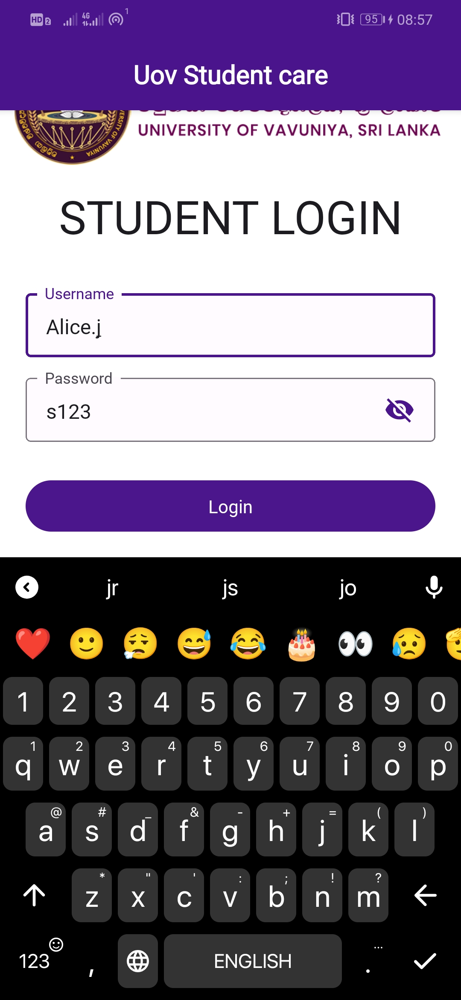
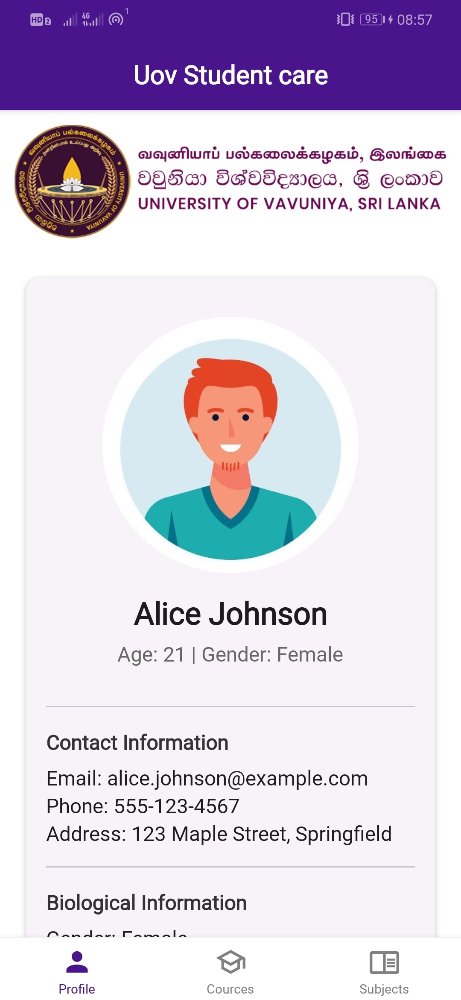
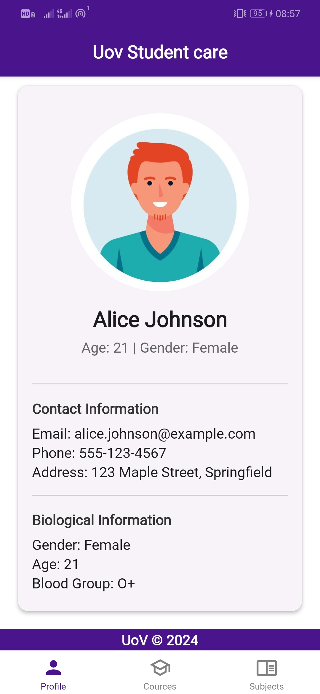
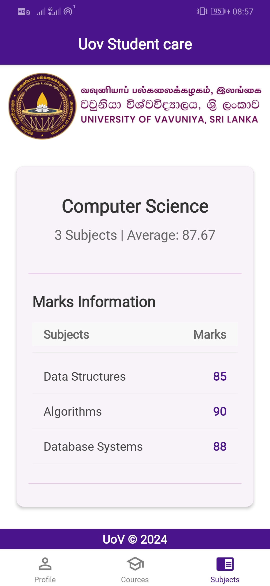
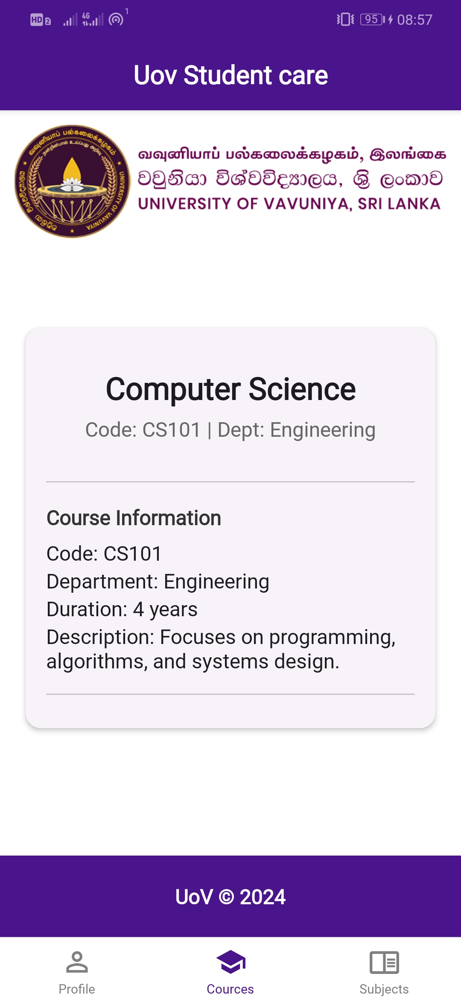

# StudentCareApp

StudentCareApp is a JavaScript-based application designed to help students view their personal details, course and subject details (and other relevant information). The application is built using React and Material-UI and is optimized for a user-friendly interface.

## Table of Contents

- [Features](#features)
- [Installation](#installation)
- [Usage](#usage)
- [Contributing](#contributing)
- [License](#license)
- [Contact](#contact)

## Features

- View Personal details
- View course and subject details
- User-friendly interface

## Installation

To install and run this project locally, follow these steps:

1. Clone the repository:

   ```shell
   git clone https://github.com/5yndr0m/studentcareapp.git
   ```

2. Navigate to the project directory:

   ```shell
   cd studentcareapp
   ```

3. Install the dependencies:

   ```shell
   npm install
   ```

4. Start the development server:
   ```shell
   npm start
   ```

## Usage

- Use the provided username and password to log into the system
- Profile tab displays your profile details
- Course tab displays your enrolled course
- Subjects tab displays subjects of your course and marks you obtained.

### Screenshots

<div style="display: flex; flex-wrap: wrap; gap: 10px; justify-content: center;">
    
    
    
    
    
    
    
</div>

### Video

<video width="300" controls>
    <source src="./assets/screenshots/video.mp4" type="video/mp4">
</video>

## Contributing

Contributions are welcome! Please follow these steps to contribute:

1. Fork the repository.
2. Create a new branch:
   ```shell
   git checkout -b feature-branch
   ```
3. Make your changes.
4. Commit your changes:
   ```shell
   git commit -m 'Add some feature'
   ```
5. Push to the branch:
   ```shell
   git push origin feature-branch
   ```
6. Open a pull request.

## License

This project is licensed under the GNU General Public License v3.0. See the [LICENSE](LICENSE) file for details.

## Contact

For any questions or feedback, please contact the repository owner:

- GitHub: [5yndr0m](https://github.com/5yndr0m)
- Email: sdilanjana21@gmail.com

---

Recent commits:

- [docs: generate the change log](https://github.com/5yndr0m/studentcareapp/commit/5c7d95d9bb88a16d73187aa49aed566a754c3c4f)
- [style: changed to darker accent color](https://github.com/5yndr0m/studentcareapp/commit/024b282b23877e59786845d93bf30c0b83c29ad2)
- [style: changed button styles](https://github.com/5yndr0m/studentcareapp/commit/755a064a43b2105736cd21303683f624cc84156c)
- [style: add styles to error container](https://github.com/5yndr0m/studentcareapp/commit/edcc6860352f88afbe35f44869239ee4f8964da0)
- [feat: changed the error display location](https://github.com/5yndr0m/studentcareapp/commit/82b82cf5e815de2d364c639b429246e5800601ae)

For more commits, visit the [commit history](https://github.com/5yndr0m/studentcareapp/commits/main).

Feel free to modify this template as needed and add the necessary screenshots and video links.
